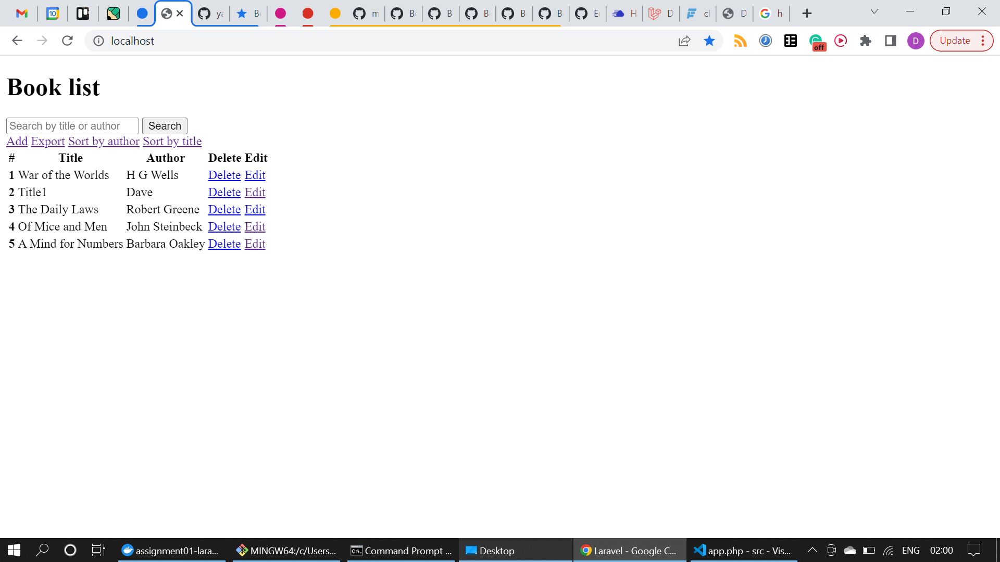

## Book list app
This project lists books stored in a SQLite database. Books can be added, edited, searched for, sorted, deleted, and exported.

  <b>Figure 1</b> 
 

## Setup
1. Clone the repository.
1. Start the containers by running `docker-compose up -d` in the project root.
1. Install the composer packages by running `docker-compose exec laravel composer install`.
1. Access the Laravel instance on `http://localhost` 

